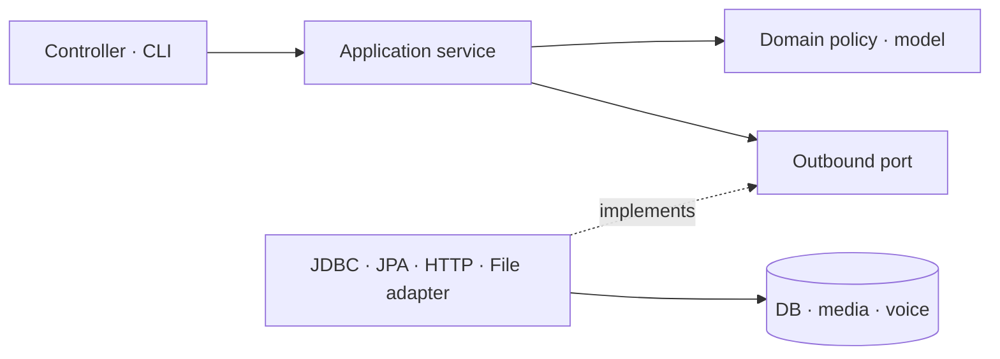

# 구조

## 구성

브라우저는 Next.js 16 프런트엔드에 접속한다. 프런트엔드의 `/api/*` Route Handler는 요청·쿠키·Range 헤더를 Kotlin 서버에 전달하는 전송 프록시이며 학습 규칙이나 데이터 저장을 맡지 않는다. 운영 Compose에서는 `BACKEND_API_URL=http://backend:8080`이다. Kotlin/Spring Boot 4 서버가 계정, 덱 소유권, 학습 세션, FSRS 결과, 검색, 통계를 처리한다. PostgreSQL 16에 사용자 데이터와 복습 이력을 저장한다. 계정 관리 CLI는 Spring Data JPA 저장소를 사용하고, 학습·import는 명시적인 SQL과 행 잠금이 필요한 구간에 JdbcTemplate을 사용한다. Flyway가 스키마를 적용하며 Hibernate는 `validate`만 한다.

| 구성 | 지속 데이터 | 외부 접근 |
| --- | --- | --- |
| Next.js 프런트엔드 | 앱 shell만 브라우저 캐시 | 기본 localhost:3200 |
| Kotlin API | 미디어 전용 볼륨 | Compose 내부 |
| PostgreSQL | 기존 infra-postgres의 kanalog 전용 DB | infra-backend 내부 |
| Supertonic 내부 계산 | 모델 읽기 전용, 최근 WAV 제한 RAM 캐시 | Compose 내부 8090, 공개 포트 없음 |
| APKG 변환 도구 | `private-data/converted` | 로컬 명령만 |

원본 APKG와 변환 JSONL은 `private-data`에 두고 Git 및 이미지 빌드에서 제외한다. 변환된 음성은 import 중 개인 미디어 볼륨으로 복사한다. `/api/media/{id}`는 DB 소유권을 확인한 후 제공하며, 미디어 볼륨을 웹 서버 정적 경로로 공개하지 않는다.

## 백엔드 패키지와 의존 방향

Dutchlog의 pragmatic DDD와 `CODERULE.md`를 따른다. `com.kanalog` 루트에는 Spring Boot 실행 진입점 `App.kt`만 둔다. 기능은 `account`, `auth`, `content`, `study`, `course`, `curriculum`, `settings`, `progress`, `imports`, `media`, `speech`, `health`로 분리한다. 오류·시간·해시·웹 요청 식별자만 `common`에 둔다.

```text
com.kanalog.<feature>/
├── domain/                  # 모델, 불변식, 순수 정책, 애그리거트 저장소 계약
├── application/             # 유스케이스 조율과 트랜잭션
│   ├── model/               # 요청·응답 DTO (Bean Validation 포함)
│   └── port/out/            # 저장·조회·외부 계산 계약
├── infrastructure/          # JDBC/JPA, FSRS SDK, 파일, HTTP 어댑터
└── presentation/            # Controller 및 관리자 CLI 진입점
```



- `domain`에는 Spring MVC·JDBC·Jackson·HTTP·파일 접근을 두지 않는다. `AppUserEntity`의 JPA 매핑은 Dutchlog와 같은 예외로 허용한다. `AppUserRepository` 계약은 도메인에, Spring Data `JpaAppUserRepository`와 `AccountRepositoryAdapter`는 인프라에 둔다.
- 카드 version/due 검사는 `ReviewState`, 개인 단어 내용은 `PersonalNote`, 문법 제목과 강조 정합성은 `GrammarFocus`, 코스 편성은 `CoursePlan`/`KanaInventory`, 연속 학습일은 `LearningStreak`, 음성 설정·입력은 각각 `AudioPreferences`/`SpeechInput`이 맡는다.
- `StudyService` 등 애플리케이션 서비스는 포트를 통해 조회·저장을 요청한다. 예외적인 가져오기 `Path`는 CLI 입력 경로 값이며, 실제 `Files` 호출과 JSONL 해석은 `NormalizedMaxImportAdapter`에만 둔다. 업무 API는 기존 Kotlin 서버에 유지한다.
- `@Transactional`은 애플리케이션에만 둔다. 평가의 사용자 행 → 카드 상태 행 잠금 순서, 상태 갱신·ReviewLog·가나 평가 저장의 원자성, 소유권 조건, idempotency key와 version 검사는 보존한다. CLI의 RUNNING/FAILED 작업 기록은 콘텐츠 가져오기 트랜잭션 밖에서 저장해 실패 상태가 남는다. 미디어 복사는 DB 트랜잭션으로 되돌아가지 않는 기존 한계가 있으며 재시도는 내용 해시 기반이다.
- 목록·통계·큐·코스는 작은 typed 조회 포트를 사용한다. 잠금과 기존 쿼리의 의미를 유지하기 위해 전체 SQL을 JPA로 바꾸지 않는다. 조회 DTO를 새 애그리거트로 감싸거나 모든 서비스에 입력 포트 인터페이스를 만들지 않는다.
- Controller는 인증 사용자와 HTTP 계약을 처리한다. 오류의 HTTP 분류는 순수 `FailureStatus`를 `Errors`에서 상태 코드로 변환한다. `MediaController`는 Range/헤더만 처리하고 파일 검증·스트리밍은 `FileMediaStore`가, 내부 TTS 통신·동시 요청 제한·WAV 검증은 `HttpSpeechSynthesizer`가 맡는다.
- `LayerDependencyTest`가 계층 의존성과 트랜잭션 배치를 검사한다. 테스트는 기능별 패키지에 두고 여러 기능을 연결하는 PostgreSQL/HTTP 테스트는 `integration`에 둔다. 외부 API·테이블·migration·FSRS 버전 변경 없이 구조를 정리했다.

## 인증과 진도

로그인은 BCrypt 해시를 검증하고 무작위 세션 토큰을 HttpOnly SameSite=Lax 쿠키에 설정한다. DB에는 토큰 원문 대신 SHA-256 해시, 만료 시각, CSRF 토큰을 저장한다. 쓰기 요청은 `X-CSRF-Token`과 브라우저 Origin을 검증한다. 운영 HTTPS에서는 `COOKIE_SECURE=true`로 설정한다. Dutchlog의 계정, 키, DB와 공유하지 않는다.

학습 세션 생성은 명시적 POST다. 서버가 사용자와 덱 소유권, 복습 우선순위, 사용자 시간대의 일일 새 카드 한도를 확인한다. 서버는 [java-fsrs 1.0.0](https://central.sonatype.com/artifact/io.github.open-spaced-repetition/fsrs/1.0.0)의 결과를 계산한다. 이 구현체의 [MIT 라이선스](https://github.com/open-spaced-repetition/java-fsrs/blob/main/LICENSE)를 확인했다. 기본 목표 유지율은 0.9이며 fuzz는 끈다. 카드 상태 전체를 JSON으로 저장한다. 카드 상태와 복습 로그는 한 트랜잭션으로 확정한다. `(user_id, idempotency_key)` 유일 제약으로 재전송을 구분하고 카드 `version`이 오래되면 409를 반환한다. 모든 저장 시각은 UTC의 `timestamptz`이며 `Asia/Seoul` 등 사용자 시간대는 일일 한도와 통계 날짜에 적용한다. 시간대를 바꾸면 오늘 한도, 연속 학습일, 최근 7일·30일 지표를 새 시간대 기준으로 즉시 다시 계산한다. 기존 `ReviewLog` 시각과 FSRS `due`는 변경하지 않는다.

## 가져오기 경계

`tools/deck-import`의 Python 표준 라이브러리 도구는 JLPT MAX v2.1.2 APKG를 검증하고 JSONL과 media map으로 변환한다. Kotlin import 명령은 DB 트랜잭션, 계정 소유권, 안정적인 source GUID와 카드 방향 키, 미디어 저장을 담당한다. 원본 템플릿 JavaScript를 실행하지 않는다. 필드와 집계는 [데이터 출처](data-sources.md), 변환 형식과 재실행 정책은 [가져오기 형식](import-format.md)을 참고한다.

## PWA

manifest와 자체 SVG/PNG 아이콘을 제공한다. 서비스 워커는 오프라인 안내 화면만 캐시한다. 인증된 학습 API 응답, 음성, 사용자별 데이터, 미제출 답변은 오프라인 캐시에 넣지 않는다.

## 학습 코스와 브라우저 음성

`learning_course` → `course_lesson` → `lesson_card`가 콘텐츠를 레슨에 연결한다. 최초 기본 코스는 히라가나 46자, 가타카나 46자 순서이며 탁음·반탁음·요음은 선택 레슨으로 분리한다. MAX는 원본 어휘/문법과 급수를 유지하면서 어휘 20장/문법 5장 단위 레슨으로 연결한다. 매핑을 다시 실행해도 카드 ID와 FSRS 상태를 초기화하지 않는다. 레슨의 최초 연습 완료는 각 활성 카드에 GOOD/EASY를 최소 한 번 제출한 상태이며 암기 완료를 뜻하지 않는다. 제외 카드가 있는 레슨의 집계와 추천은 활성 카드 기준이다.

Supertonic 3는 브라우저 Web Worker에서 고정된 ONNX 모델로 일본어 음성을 생성한다. ONNX Runtime Web 1.30.0은 WebGPU를 우선 시도하고 사용할 수 없으면 WASM 단일 스레드를 사용한다. 모델은 별도 디렉터리에서 같은 origin의 `/tts/supertonic`으로 제공하며 이미지에 넣지 않는다. 브라우저 모드에서는 텍스트를 서버로 전송하지 않는다. iPhone·iPad(데스크톱 UA iPad 포함)는 대형 모델의 브라우저 메모리 사용을 피하기 위해 `/api/speech`로 텍스트·목소리를 자체 Kotlin API에 보내고 작은 WAV만 받는다. 기존 쿠키·Origin·CSRF 인증 후 고정 내부 계산 주소로 전달하며 타사 TTS로 전송하지 않는다. 읽기 필드가 있는 단어는 읽기를, 가나는 해당 글자를 합성한다. 한국어 문법 질문은 합성하지 않고 일본어 예문만 듣는다.

계정 설정의 `audioEngine`은 SUPERTONIC/ORIGINAL/DEVICE, `supertonicVoice`는 F1..F5/M1..M5이며 기본값은 SUPERTONIC/F1이다. 생성된 WAV는 해당 페이지 메모리의 Blob URL로만 재생하고 취소/페이지 이탈 시 해제한다. 취소된 요청의 결과는 재생하지 않는다. 원본 MAX 음성을 별도 버튼으로 비교할 수 있으며 기기 음성은 ja-JP만 사용한다.
# 레벨별 커리큘럼 읽기 모델

`CurriculumService`는 인증된 사용자의 `CourseService.list` 결과를 `CurriculumBuilder`로 구성한다. 고정 6레벨, 왕초보 기본 2개 코스·선택 확장 2개 집계 항목, 각 JLPT 급수의 어휘/문법 비례 분산 단원이다. DB에 이미 저장된 카드·레슨 ID와 진도를 재사용하며 가나는 V8의 `kana_practice_state`에 마지막 자기 평가를 보존한다. 일반 FSRS 평가와 가나 연습 평가를 합쳐 첫 연습 진도를 계산한다.

프런트엔드의 `curriculum` Query를 홈·코스·레벨 상세·세션 완료·통계에서 공유한다. 현재 단원은 펼치고 다른 단원은 접힌 목차로 표시한다. 추천은 서버가 반환한 레슨 ID를 따른다. 기본 진도는 선택 확장을 제외하며, 복습 건수는 확장도 포함한다. 조회와 화면 이동은 학습 기록을 생성하지 않는다.


## 모바일 음성 계산 경계

`tools/voice-server`는 공식 helper를 동일하게 사용하고 ONNX Runtime Node 1.30.0 CPU로 추론한다. 모델 파일은 manifest의 크기·SHA-256 확인 후 읽기 전용 volume에서 직접 연다. 계정·DB·세션·진도에는 접근하지 않는다. 입력은 텍스트(최대 500자)와 고정 목소리 F1..F5/M1..M5뿐이다. 추론은 동시에 하나만 허용하며 바쁜 경우 429, 계산 실패는 503으로 반환한다. 완성 WAV는 최대 32MiB/256개 RAM LRU에 보관하며 재시작 때 제거한다. 사용자 본문과 WAV를 로그나 디스크 캐시에 저장하지 않는다. API 응답은 `private, no-store`다.

Kotlin adapter는 연결 3초·요청 45초 제한과 최대 8MiB WAV 검증을 적용한다. 실패 시 브라우저 모델 다운로드로 자동 전환하지 않는다. 프런트는 취소 후 도착한 결과를 버리고 기존 재생·페이지 이탈 정리를 유지한다. 재생 준비 중 사용자 동작 권한이 만료되면 준비된 음성 재생 버튼으로 다시 시작한다. Safari 재시작의 실기기 로그는 확보하지 않았으므로 메모리 종료를 확정한 것은 아니다.


## 가나 혼합 세션

섞기 UI는 문자 종류와 포함 분류만 전송한다. 서버는 가나 요청을 항상 전체 범위 자유 연습으로 처리하며 이전 클라이언트의 장수·모드값으로 축소하지 않는다. 레슨/덱 범위에도 명시적인 자유 연습을 적용할 수 있으며 서버의 소유권 검증과 세션 모드로 동작한다. 세션 생성의 `queueInfo`가 빈 큐 원인을 알려 주고, 프런트엔드는 답변 없는 진입과 실제 학습 완료를 분리한다. 가나 평가 저장 후 코스·커리큘럼 쿼리를 갱신한다. ReviewLog 기반 복습 통계는 일반 학습에서 갱신한다.

가나 범위는 기존 `learning_course`와 `course_lesson.position`의 기본 0~9·탁음 10~13·반탁음 14·요음 15로 실제 카드 ID를 찾는다. 소유자·READY·활성 카드만 포함하고 제외 상태를 큐에서 확인한다. 여러 덱을 포함하는 세션만 `deck_id`가 null이며 `session_title`에 표시 이름을 보관한다. 일반 학습은 같은 UserCardState·ReviewLog 트랜잭션, FSRS 버전·중복 키·전역 사용자 잠금을 재사용한다. 최근 평가로 후보 순서를 정하고 같은 평가 내에서 섞은 뒤 `session_card.position`으로 고정한다.

자유 연습 모드는 세션의 서버 저장 `practice` 플래그로 구분한다. `practice_answer`의 `(user_id,idempotency_key)`·`(session_id,card_id)` 유일 제약과 기존 사용자 행 잠금으로 중복 답변을 막는다. 일반 ReviewLog와 요청 키 충돌도 검사한다. UserCardState를 만들거나 변경하지 않으므로 이미 본 문자·미학습 문자 모두 원래 복습일과 한도를 유지한다. 복습 통계는 ReviewLog 기준을 유지하고 가나 커리큘럼은 practice_answer도 포함한다. V7은 컬럼·표를 추가하고 기존 ID·진도를 초기화하지 않는다.

## 가나 단일 코스·평가 반영

히라가나·가타카나는 각각 한 코스로 표시한다. 내부 행 매핑·기존 카드 ID와 세션은 보존하고 커리큘럼 버전 2에서 기본/확장 통계를 합친다. 모든 주요 가나 링크는 분류 선택 코스로 진입한다.

사용자 행 잠금 뒤 평가 로그와 최근 평가를 한 트랜잭션으로 저장한다. 서버가 최근 평가 기준 AGAIN → HARD → 미평가 → GOOD → EASY 순으로 큐를 만들고 그룹 내 순서를 섞는다. 기존 카드 범위·제외·소유권을 먼저 적용한다. 개수/일일 한도/복습 시각 제한 없이 선택한 모든 문자를 한 번씩 포함한다. 같은 요청 키의 재전송은 로그와 시도 수를 늘리지 않는다. 이후 GOOD/EASY 평가는 이전 AGAIN/HARD 우선순위를 해제한다.

## 긴 문법 카드 표시

MAX 문법은 원본에서 강조한 일본어를 28~34px 제목으로 표시한다. 먼저 문형·한국어 뜻(20px)·쓰임과 접속(18px)을 읽고, 강조된 예문(24px)을 확인한 뒤 정답을 펼치면 한국어 해석과 상세 설명을 보여준다. 전체 1,078개 원본에서 확인한 예문·한국어 해석·핵심 표현·뉘앙스·접속·헷갈리는 문형 구조를 프런트의 `structureGrammarAnswer`가 분리한다. 예문과 뜻은 중복 표시하지 않는다. 원본의 정확한 구분 제목·순서·예문 일치를 검사하고 미확인 구조는 전체 원문을 문단으로 표시한다. 강조 정보가 없는 기존 카드는 예문 질문과 전체 해설을 보존한다. 설명 제목을 별도 번호·배경·테두리가 있는 섹션으로 제공한다. 원본 내용·순서는 유지하고 HTML이나 원본 템플릿을 실행하지 않는다. `Kind`에 들어 있는 보이지 않는 포맷 문자와 내용 없는 기호는 표시에서만 걸러 빈 설명 패널을 만들지 않는다. 실제 일본어 읽기·음성이 없는 문법은 자동재생을 시도하지 않는다. 일본어 예문과 연결된 음성이 있으면 기존 예문 듣기 버튼을 사용한다.

변환기의 `grammarFocus`는 확인된 원본 mark 위치를 안전한 텍스트 조각으로 저장한다. Kotlin import와 카드 조회에서 조각 합계·제목을 검증하고 소유자 범위의 카드 응답에만 전달한다. 동일한 단어가 반복되어도 다른 위치를 추가로 강조하지 않는다. 원본에 없는 문형 공식을 만들지 않는다. 기존 계정은 전용 `refresh-grammar-focus` CLI로 본문 일치를 검증한 후 메타데이터만 갱신하며 FSRS 상태·평가·카드 ID는 보존한다.

모바일에서는 카드 내부만 스크롤되고 평가 버튼은 하단 탐색 위에 유지된다. 카드·세션이 바뀌면 카드 스크롤을 초기화해 새 질문이 잘리지 않게 한다. 가나와 어휘는 기존 큰 일본어 표기를 유지한다.

## 단어장 목록과 상세

단어장은 서버에서 전체/단어/문법/가나를 필터링하고 검색 조건과 함께 페이지네이션한다. 분류·검색어가 바뀌면 첫 페이지부터 조회한다. 노트 API는 실제 유형·급수와 원본 문법 강조 정보를 소유자 범위에서 반환한다. DB schema와 원본 본문은 변경하지 않는다.

목록의 `NoteEntry`는 문형 또는 단어 제목·읽기·짧은 뜻을 두 줄 이내로 요약한다. 북마크는 독립된 44px 버튼이며 상세 펼치기와 중첩하지 않는다. HTML details/summary로 펼친 상세에서 문법은 원본 강조 예문·해석·뉘앙스·접속·비교 설명, 단어는 뜻·예문·해석·개인 메모를 구분한다. 긴 원문은 상세에서 온전히 읽을 수 있다. 목록은 모바일 한 열, 태블릿/PC 두 열이다. 학습 제외와 개인 편집은 상세 하단에 두며 제외 상태는 목록 배지로 표시한다.

원본 문법 설명은 학습 화면과 같은 parser/강조 renderer를 재사용한다. 출처명은 화면에 표시하지 않고 가져온 원본의 편집 제한은 유지한다. 저장 중 수정·북마크·제외 요청은 중복 제출하지 않는다. 개인 단어 폼은 여러 줄 뜻·예문·메모를 보존하고 새 단어 저장 후 첫 단어 목록으로 돌아간다. 저장 실패 시 입력 내용은 유지한다.

단어장 상세의 듣기는 `useNoteAudio` 하나로 관리한다. 단어는 가나 읽기(없으면 일본어 표기), 가나는 실제 글자, 문법은 앞면의 일본어 예문, 단어 예문은 별도 일본어 필드만 합성한다. 한국어가 섞인 해설·메모는 합성하지 않는다. 선택한 엔진·목소리·속도를 설정 API에서 읽으며 원본 파일은 인증된 media API로 재생한다. 기기 엔진은 일본어 목소리만 사용한다.

기존 `useGeneratedAudio`를 재사용하므로 iPhone/iPad는 자체 서버 WAV, PC는 브라우저 모델을 사용한다. 한 번에 한 항목만 재생하고 상세 접기·검색·분류·페이지·화면 이동은 재생과 생성을 취소한다. 취소된 요청의 늦은 응답은 무시하고, Safari 재생 제한 시 준비된 파일을 새 합성 없이 사용자 터치로 재생한다. 단어장에서는 자동재생하지 않는다. 학습 화면의 일본어 문법 예문은 기존 정답 전 허용·자동재생 설정을 따른다. 음성 듣기만으로 학습 진도나 평가 기록을 만들지 않는다.
